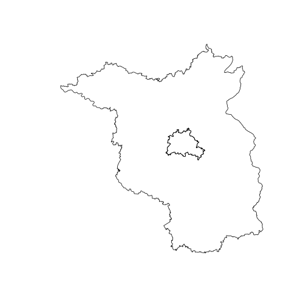

<!-- README.md is generated from README.Rmd. Please edit that file -->


# nutscoder

{nutscoder} provides the function `nuts_geocode`, which attempts to find [NUTS region codes](https://ec.europa.eu/eurostat/web/nuts/background) for location names by using [Nominatim](https://nominatim.org) to search [OpenStreetMap (OSM)](https://www.openstreetmap.org) data.

<!-- badges: start -->
[](https://lifecycle.r-lib.org/articles/stages.html#experimental)
[](https://CRAN.R-project.org/package=nutscoder)
[](https://github.com/RegioHub/nutscoder/actions)
<!-- badges: end -->

## Installation

You can install the development version of {nutscoder} like so:

``` r
remotes::install_github("RegioHub/nutscoder")
```

## Usage


```r
library(nutscoder)
nuts_geocode(c("Hamburgo", "هامبورغ", "HH", "Berlin", "🐻Bärlin", "ベルリン",
               "North Rhine-Westphalia", "nrw"))
#> # A tibble: 8 × 5
#>   location               name                nuts_1 nuts_2 nuts_3
#>   <chr>                  <chr>               <chr>  <chr>  <chr> 
#> 1 Hamburgo               Hamburg             DE6    DE60   DE600 
#> 2 هامبورغ                Hamburg             DE6    DE60   DE600 
#> 3 HH                     Hamburg             DE6    DE60   DE600 
#> 4 Berlin                 Berlin              DE3    DE30   DE300 
#> 5 🐻Bärlin               Berlin              DE3    DE30   DE300 
#> 6 ベルリン               Berlin              DE3    DE30   DE300 
#> 7 North Rhine-Westphalia Nordrhein-Westfalen DEA    <NA>   <NA>  
#> 8 nrw                    Nordrhein-Westfalen DEA    <NA>   <NA>
```

The [sf](https://r-spatial.github.io/sf/) geometry of the geocoded NUTS regions can be returned:


```r
nuts_geocode(c("berlin", "brandenburg"), return_geometry = TRUE) |> 
  sf::st_geometry() |> 
  plot()
```



The argument `nominatim_api` can be used to specify the API URL of the Nominatim instance used to search for OSM data. By default, `nuts_geocode()` uses the public Nominatim instance (`nominatim_api = "https://nominatim.openstreetmap.org"`), which has an absolute maximum of 1 request per second and is not suitable for intensive use. You can [install your own instance of Nominatim](https://nominatim.org/release-docs/latest/admin/Installation/) to avoid the limitations of the public instance.

## Citation


To cite package 'nutscoder' in publications use:

  Nguyen HL (2023). {nutscoder}: Geocoding to NUTS Region Codes.
  <https://doi.org/10.5281/zenodo.XXXXXXX>,
  <https://github.com/RegioHub/nutscoder>

A BibTeX entry for LaTeX users is


```
@Manual{,
  title = {{nutscoder}: Geocoding to NUTS Region Codes},
  doi = {10.5281/zenodo.XXXXXXX},
  author = {H. Long Nguyen},
  year = {2023},
  version = {0.1.0},
  url = {https://github.com/RegioHub/nutscoder},
}
```

## Disclaimers

The use of the server running at <https://nominatim.openstreetmap.org> is governed by the [Nominatim Usage Policy](https://operations.osmfoundation.org/policies/nominatim/). 

Geodata from OpenStreetMap are licensed under the terms of the [Open Database License (ODbL) 1.0](http://www.opendatacommons.org/licenses/odbl/).

Use of any OSMF provided service is further governed by the [OSMF Terms of Use](https://wiki.osmfoundation.org/wiki/Terms_of_Use).
