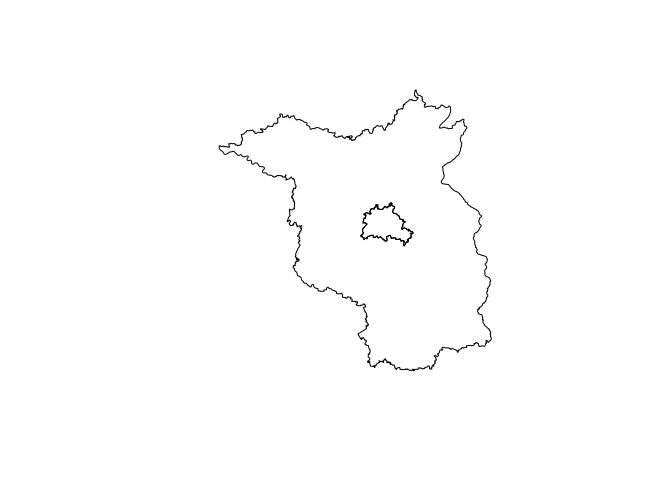

<!-- README.md is generated from README.Rmd. Please edit that file -->

# nutscoder

{nutscoder} provides the function `nuts_geocode`, which attempts to find [NUTS region codes](https://ec.europa.eu/eurostat/web/nuts/background) for location names.

<!-- badges: start -->

[](https://lifecycle.r-lib.org/articles/stages.html#experimental)
[](https://CRAN.R-project.org/package=nutscoder)
[](https://github.com/long39ng/nutscoder/actions)
<!-- badges: end -->

## Installation

You can install the development version of {nutscoder} like so:

``` r
remotes::install_github("long39ng/nutscoder")
```

## Example

``` r
library(nutscoder)
nuts_geocode(c("munich", "hamburg"))
#> # A tibble: 2 × 5
#>   location name    nuts_1 nuts_2 nuts_3
#>   <chr>    <chr>   <chr>  <chr>  <chr> 
#> 1 hamburg  Hamburg DE6    DE60   DE600 
#> 2 munich   München DE2    DE21   DE212
```

The [sf](https://r-spatial.github.io/sf/) geometry of the geocoded NUTS regions can be returned:

``` r
nuts_geocode(c("berlin", "brandenburg"), return_geometry = TRUE) |> 
  sf::st_geometry() |> 
  plot()
```


